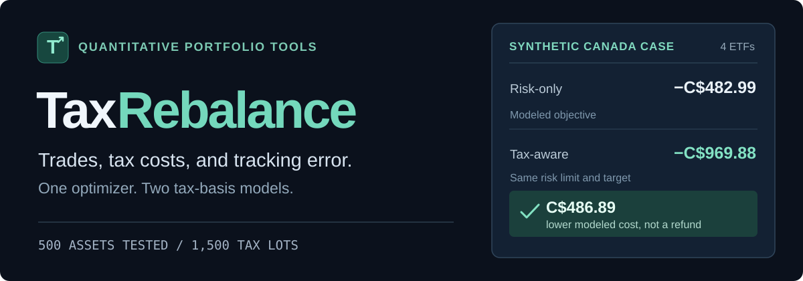
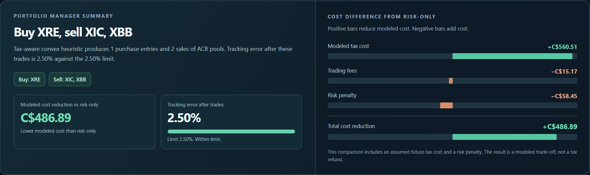
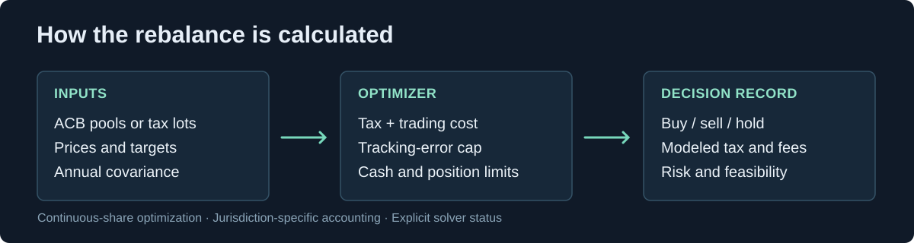

<p align="center">
  
</p>

<p align="center">
  <a href="https://garroshub.github.io/taxrebalance/"></a>
  <a href="#quickstart"></a>
  <a href="#model-and-tax-rules"></a>
  <a href="#reproduce-the-results"></a>
</p>

<p align="center">
  <strong>Python 3.10+</strong> · CVXPY / Clarabel · Canadian ACB + U.S. tax lots · Continuous-share optimization
</p>

TaxRebalance chooses portfolio trades for a supplied target allocation, balancing estimated tax effects, transaction costs, and risk constraints. It works with user-supplied prices, covariance matrices, and taxable holding histories. The included website uses synthetic accounts and stored solver results.

## See the decision

The live demo compares feasible rebalancing methods, showing **what to buy and sell**, how far the allocation moves toward its target, and how the modeled cost divides into taxes, fees, and risk.

<p align="center">
  <a href="https://garroshub.github.io/taxrebalance/"></a>
</p>

A four-ETF synthetic Canadian portfolio gives the following model outputs at a **2.5% annual tracking-error limit**.

| Method | Modeled objective (CAD) | Risk feasible |
| :-- | --: | :-- |
| Risk-only | −C$482.99 | Yes |
| Tax-aware heuristic | **−C$969.88** | Yes |
| Small-model enumeration | −C$969.88 | Yes |

**C$486.89 lower modeled cost** is the difference between the first two objectives. It is **not** a tax refund, investment return, or projected profit. The objective includes an assumed future tax recapture and a risk penalty. The U.S. scenario uses a separate simulated tax-lot portfolio.

## Quickstart

Clone and install the package from GitHub:

```bash
git clone https://github.com/garroshub/taxrebalance.git
cd taxrebalance
python -m pip install -e .
```

The Python API accepts explicit transactions, price inputs, target weights, and covariance. This example runs without external account data:

```python
from datetime import date
from taxrebalance import (
    CADTransaction, CanadaACB, Portfolio, RebalanceConfig, rebalance
)

portfolio = Portfolio(
    jurisdiction="CA",
    prices={"XIC": 100.0, "XEF": 100.0},
    transactions=(
        CADTransaction(date(2025, 1, 10), "XIC", "BUY", 60, 115),
        CADTransaction(date(2025, 2, 12), "XEF", "BUY", 40, 85),
    ),
    valuation_date=date(2026, 10, 8),
)

result = rebalance(
    portfolio,
    target_weights={"XIC": 0.50, "XEF": 0.50},
    covariance=[[0.04, 0.01], [0.01, 0.04]],
    tax_policy=CanadaACB(marginal_rate=0.42, inclusion_rate=0.50),
    config=RebalanceConfig(max_tracking_error=0.015),
)

print(result.summary())
print(result.trades)
```

The CLI accepts a Canadian transaction CSV or U.S. tax-lot CSV, plus JSON inputs for prices, target weights and covariance:

```bash
python -m taxrebalance --jurisdiction CA --portfolio transactions.csv \
  --prices prices.json --targets targets.json --covariance covariance.json \
  --valuation-date 2026-10-08 --output decision.json
```

Canadian CSV columns: `date,ticker,side,shares,price_cad,fee_cad,account`. U.S. lot columns: `lot_id,ticker,shares,basis_per_share,days_held,prior_30d_replacement`. The covariance matrix must follow the ticker ordering in the prices input.

## Model and tax rules

<p align="center">
  
</p>

| | Canada | United States |
| :-- | :-- | :-- |
| Tax basis | Average adjusted cost base across the taxpayer's own taxable accounts | Individual acquisition lots |
| Sale basis | One averaged pool per identical security | Individual tax-lot selection |
| Loss screening | Conservative superficial-loss lookback flags | Simplified prior replacement flags |
| Illustrative tax inputs | 50% capital-gain inclusion × 42% marginal rate | 20% long-term / 35% short-term |
| Demo cases | 6 synthetic CAD portfolios | 5 synthetic USD portfolios |

The model enforces a tracking-error cap, nonnegative holdings, available sale quantities, and a nonnegative post-trade cash balance. A security is assigned a **buy, sell, or hold** direction at each rebalance.

The default algorithm relaxes direction choices, fixes trade directions, and searches local alternatives using convex subproblems. Exact enumeration is available only for **up to four assets**, with continuous share quantities and numerical solver tolerance. It is not a global certificate for larger portfolios or real-world tax compliance.

The website contains **11 fictional portfolio cases** and **108 separately solved parameter combinations**, spanning tracking-error limits, trading fees, assumed loss utilization, and future tax recapture. The static page reads those results; arbitrary new inputs require the Python solver.

## Reproduce the results

```bash
python -m pip install -e ".[test]"
python -m pytest -q test_canadian_rebalancing.py test_tax_rebalancing.py tests_package/
python tools/verify_dashboard.py
```

To serve the static demo locally:

```bash
python -m http.server 8000 --directory docs
```

The regression suite covers tax-basis accounting, cash and position feasibility, optimization comparisons and the public Python API. The optional Playwright browser test is `python tools/test_browser_dashboard.py`.

<details>
<summary><strong>Model limitations and source layout</strong></summary>

Canada's ACB engine groups identical holdings across the taxpayer's own taxable accounts. It does not merge affiliated persons' cost bases or determine final superficial-loss treatment, future acquisitions, or disallowed-loss ACB adjustments. The U.S. tax-lot model uses simplified wash-sale flags. Actual tax treatment depends on additional information beyond either model.

This is a one-period, continuous-share rebalancing model using assumed prices, tax parameters, covariance and future loss utilization. It has no brokerage execution, price feed, return prediction, tax filing, or claim of tax alpha.

- `taxrebalance/` — public API and CLI
- `tax_rebalancing/` — accounting models and CVXPY optimization
- `docs/` — static interactive demo
- `tools/` — scenario generation and browser checks
- `RESEARCH_DESIGN.md` — model equations, assumptions and boundaries

</details>

MIT license · `LICENSE`
